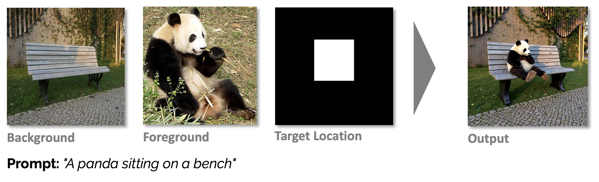
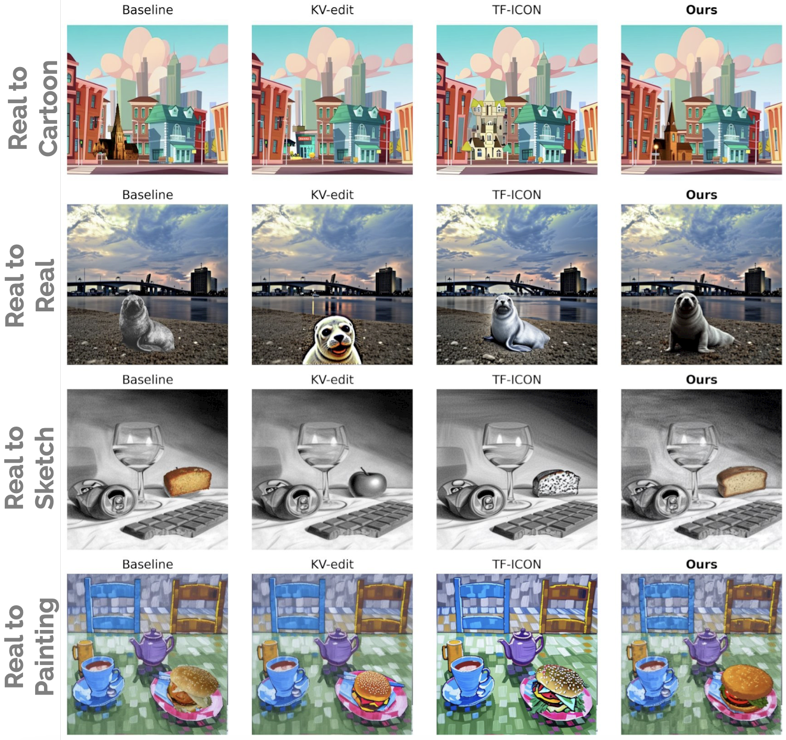

# DiT-Edit: Image Composition with Diffusion Transformers 🖼️🎨✨

> #### **Overview**
> - 🎯 **Exemplary-based:** transfer your object instead of generating a new one!
> - ♻️ **Training-free:** leverage pre-trained SoTA Diffusion Transformers (DiTs) like FLUX.
> - 💬 **Text-guided:** use text prompts to refine the composition or add new features.
> - 🎚️ **Tunable parameters:** offers flexible control over the process, allowing



### TODOs:
- [ ] Move KV-Edit and TF-ICON code into a separate folder with git submodules
- [ ] Clean notebooks folder
- [ ] Add a bit of evaluation in the README


## Table of Contents
- [Installation](#installation)
    - [Core package](#core-package)
    - [Setting Up Pre-Commit Hooks](#setting-up-pre-commit-hooks)
    - [Download Scoring Models](#download-scoring-models)
    - [Third Party Baselines](#third-party-baselines)
- [Codebase Structure](#codebase-structure)
- [Running DiT-Edit](#running-the-main-scripts)
    - [Single Image Composition](#1-single-image-composition)
    - [Benchmark Evaluation](#2-benchmark-evaluation)
- [Some more examples](#some-more-examples)
- [Running on izar cluster](#running-on-izar-cluster)


## Installation
### Core package
First, create a python environment with python 3.9 or higher, and install the `dit_edit` package and its dependencies:

```bash
python -m venv venv
source venv/bin/activate
pip install -e .
```
The installed package will be available as `dit_edit` in your environment and it offers two entry points commands:
- `dit-run`: for running DiT-Edit on a single pair of background/foreground images.
- `dit-run-benchmark`: for running DiT-Edit over the entire benchmark dataset or a subset of it.

More about how to use these commands can be found in the [Running DiT-Edit](#running-the-main-scripts) section below.

#### Benchmark Images
For simplicity, the samples from the benchmark introduced by [TF-ICON](https://github.com/Shilin-LU/TF-ICON) are included in the repository, together with generations obtained with DiT-Edit, as well as other methods. Everything is under the `benchmark_images_generations/` directory.

#### Setting Up Pre-Commit Hooks
After cloning the repository and installing dependencies as described above (which includes `pre-commit` via `setup.py`), you need to install the git hooks:

```bash
pre-commit install
```

#### Download Scoring Models
If you want to run the quantitative benchmarking, you'll need to download the aesthetic score predictor and place it in the root of the directory.

```bash
wget https://github.com/christophschuhmann/improved-aesthetic-predictor/raw/refs/heads/main/sac+logos+ava1-l14-linearMSE.pth
```

#### Third Party Baselines
To compare our results with other state-of-the-art methods, we cloned their code and applied minor modifications for compatibility. More information in [the `baselines/` readme file](baselines/README.md).
To initialize the submodules, run:

```bash
git submodule update --init --recursive
```

## Codebase Structure

The project is organized as follows:

- **`benchmark_images_generations/`**: Default directory where samples from benchmark are stored, together with the output images and metrics from `run_on_benchmark.py`.
- **`src/dit_edit/`**: Contains the core logic for the DiT-Edit method.
    - **`core/`**: Core components like the FLUX pipeline modifications (`flux_pipeline.py`), inversion logic (`inversion.py`), and attention/feature injection processors (`dit_edit_processor.py`).
    - **`data/`**: Data loading utilities, including benchmark data handling.
    - **`evaluation/`**: Evaluation scripts and metrics.
    - **`utils/`**: Utility functions for inference, logging, etc.
    - **`config.py`**: Centralized configuration management using a dataclass (`DitEditConfig`) for hyperparameters shared across scripts.
    - **`run.py`**: Script for running DiT-Edit on a single pair of background/foreground images with a bounding box.
    - **`run_on_benchmark.py`**: Script for running DiT-Edit over the entire benchmark dataset or a subset of it.
- **`notebooks/`**: Jupyter notebooks for experimentation, visualization, and examples.
- **`scripts/`**: Utility scripts for data processing, aggregation, or specific tasks like ablation studies.
- **`baselines/`**: Directory containing code for other methods used for comparison.
- **`assets/`**: Static assets including example images, ablation results, diagrams and other illustrations.

## Running the Main Scripts

The two primary scripts for using DiT-Edit are `src/dit_edit/run.py` and `src/dit_edit/run_on_benchmark.py`. Both scripts share a common set of hyperparameters defined in `src/dit_edit/config.py`, which can be overridden via command-line arguments.

After installing the package with `pip install -e .`, you can also run these scripts as commands: **`dit-run`** (equivalent to `python src/dit_edit/run.py`) and **`dit-run-benchmark`** (equivalent to `python src/dit_edit/run_on_benchmark.py`)

Both scripts use `DitEditConfig` for configuration management, allowing you to easily adjust hyperparameters and settings, therefore sharing the following arguments:
- `--tau-alpha`: Controls blending vs. subject consistency in the foreground injection. Higher values lead to more exploration, perhaps leading to better blending while loosing fidelity to the foreground.
- `--tau-beta`: Controls the strength of the background consistency. Higer values lead to more background consistency.
- `--timesteps`: Number of diffusion steps. The more steps, the more refined the output, but also the longer the processing time.
- `--guidance-scale`: Guidance scale for the diffusion model.
- `--seed`: Random seed for reproducibility.
- `--inject-(q|k|v)` or `--no-inject-(q|k|v)`: Allow controlling which attention layers are used for injection. By default, only Q and K are used.
- `--layers-for-injection`: Specifies which layers to inject the foreground into (`all` or `vital`). Default is `all`.
- `--alpha-noise`: Controls the amount of random noise added before starting the composition process.


#### 1. Single Image Composition

This script allows you to compose a foreground image onto a background image given a bounding box mask.

**Basic Usage:**
Using the command:
```bash
dit-run \
    --bg_path /path/to/your/background_image.jpg \
    --fg_path /path/to/your/foreground_image.png \
    --bbox_path /path/to/your/bounding_box_mask.png \
    --output_path /path/to/save/composed_image/ \
    --prompt "An optional text prompt describing the desired composition"
```

#### 2. Benchmark Evaluation
[This script](src/dit_edit/run_on_benchmark.py) runs the DiT-Edit method over a predefined benchmark dataset (expected to be in `benchmark_images_generations/`). It generates images and calculates evaluation metrics.

**Basic Usage:**

Using the script directly:
```bash
dit-run-benchmark # or
python src/dit_edit/run_on_benchmark.py
```

**Key Arguments:**
*   `--run-on-first N`: Process only the first N images from each category in the benchmark. Set to -1 to run on all (default).
*   `--random-samples`: If used with `--run-on-first N` (where N > 0), randomly sample N images from each category.
*   `--random-samples-seed SEED`: Seed for the random sampling.
*   `--skip-available`: If set, skips processing for image/parameter combinations where output files already exist.
*   `--save-output-images` or `--no-save-output-images`: Control whether to save the generated images (metrics will still be saved).


## Some more examples

*Examples showcasing the capabilities of DiT-Edit across domains, compared to baselines.*


## Running on izar cluster
EPFL SCITAS izar cluster provides nodes with Nvidia V100 GPUs (32GB). Hereafter is a quick tutorial to set up the environment for development.

1. **Start a job:**
    ```bash
    # from izar login node
    sbatch scripts/izar/remote.run

    # or, if you want to use N GPUs
    sbatch --gres=gpu:N scripts/izar/remote.run
    ```
2. **Connect to the node:**
    ```bash
    # from izar login node
    srun --pty --jobid <job_id> /bin/bash
    ```
3. **Start jupyter server:**
    ```bash
    # from izar compute node
    source .venv/bin/activate
    module load tmux
    tmux
    hostname -i
    jupyter-notebook --no-browser --port=8888 --ip=$(hostname -i)
    ```

    You will then need to forward the port from the compute node to your local machine. Open a new terminal on **your local machine** and run the following command:

    ```bash
    # from your local machine
    ssh -L 8888:<compute_node_ip>:8888 <your_username> izar.epfl.ch -f -N
    ```
    In case you can't see the ip of the compute node correctly in the output of the jupyter server, you should see it as an output of the command `hostname -i` run in the compute node.

    Troubleshooting: you might encounter the following error when running the command above:
    ```bash
    bind [::1]:8888: Address already in use
    channel_setup_fwd_listener_tcpip: cannot listen to port: 8888
    Could not request local forwarding.
    ```
    In such case you can identify a running process using the port 8888 and kill it:
    ```bash
    lsof -i :8888
    kill <pid>
    ```
    where `<pid>` is the process id of the process using the port 8888.

4. **Open jupyter notebook:**

    Open your browser and go to `http://127.0.0.1:8888/tree?token=<token>`, where `<token>` is the token printed in the output of the jupyter server command.

⚠️ Remember to stop the job when you are done. You can do this by running the following command from the izar login node:
```bash
scancel <job_id>
```